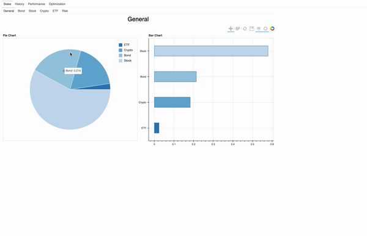

# Portfolio Analysis 

Libraries:

Dependences:

------

------

## Contents

- [Description & Goal](#description-&-goal)
- [Dataset](#dataset)
- [Features](#features)
    - [Stake Analysis](#stake-analysis)
    - [History Data Analysis](#history-analysis)
    - [Performance Analysis](#performance-analysis)
    - [Optimization Analysis](#optimization-analysis)
- [Roadmap](#roadmap)
- [Contribution](#contribution)  
- [Try it!](#try-it)

---------

## Description & Goal

This project born from the need to **analyze your own financial portfolio**, in order to make you well understand which are your
next decision for the future investments.

You will be able to:
 - analyze the **stake** for each financial category (ETF, Crypto, Stock, ecc.)
 - analyze the **historical data** and **the performance on your portfolio** for each securities
 - analyze the suggested **portfolio optimization** for each financial category

--------

## Dataset

For the current version (v1.0), **two json files** are needed in input for using the project functionalities:

### ticker_details.json

This file contains **all unique securities information**. Each time you add a transaction, you need to have
defined its ticker in this file.

**Historical data** will be **automatically loaded** basing on the tickers in the ticker_details.json file

    [
      {
        "ticker_id": "AIAI.MI",                         Ticker from Yahoo Finance
        "ticker_name": "L&G Artificial Intelligence",   Short Description      
        "isin":"IE00BK5BCD43",                          Ticker ISIN
        "instrument": "ETF",                            Arbitrary category
        "risk": 6,                                      Risk Value
        "fee": 0.49                                     Fee
      },
      {
        "ticker_id": "AIAI.MI",
        ...
      }
    ]

  

### transactions.json

This file contains all the transactions of your portfolio

    [
      {                  [BUY EXAMPLE]
        "date": "2021-04-23",       Transaction date
        "ticker_id": "ECAR.MI",     Ticker from Yahoo Finance
        "action": "buy",            'buy' or 'sell' 
        "quantity": 19.0,           Quantity bought or sold
        "price": 6.391,             Price at transaction time
        "commission": 2.04,         Commission paid for the transaction
        "gain": null,               Gain from an eventual sell
        "spent": 123.469            Total spent for the transaction
      },
      {                  [SELL EXAMPLE]
        "date": "2021-09-20",
        "ticker_id": "WTEC.MI",
        "action": "sell",
        "quantity": 2.0,
        "price": 99.14,
        "commission": 2.06,
        "gain": 196.22,
        "spent": 0.0
      },
    ]

### Historical data

The historical data for each securities are automatically downloaded, basing on the 
tickers defined in the ticker_details.json. 
This data are taken from **Yahoo Finance** and they include the following features:
**Open, Close, High, Low, Volume**

--------

## Features

### Stake Analysis

- It permits you to analyze the **overall stake** of the financial portfolio

[comment]: <> ()

- In a more specific use case it could be useful to analyze also the **stake relative to the instruments**
  of portfolio. Here is an example of the *stocks stake*.

[comment]: <> ()

- Furthermore, defining the risk in the ticker_details, it is possible to analyze the stack by risk
represented by the securities. An example of a **risk stake** is the following one.

[comment]: <> ()

### History Analysis

- This feature led to analyze the historical data for each security in your ticker_details.json.
It shows the candlestick and the volume plots.
Here are two examples of the view for some tickers (in this case AIAI.MI and ADA-EUR).

[comment]: <> ()

[comment]: <> ()

- It is possible to zoom, if the tool is active on the toolbar, as showed in the following example.

[comment]: <> ()

### Performance Analysis

- It makes you aware of performance of each security in the financial portfolio.
The hover permit to understand the value of performance in each point of the plot.
Here is an example with TSLA and AAPL.

[comment]: <> ()

[comment]: <> ()

### Optimization Analysis

It permits analyzing the suggested portfolio optimization. 
There are both optimizations for each financial categories and with all securities in the ticker_details.json.
Here are two example of portfolio optimization for **all** securities and for **stock** securities.

[comment]: <> ()

[comment]: <> ()

--------

## Roadmap

*Version 1.0*

- [x] Portfolio stake
- [x] Portfolio performance by ticker
- [x] Ticker history data
- [x] Portfolio Optimization (**Markowitz model**)

*Version 2.0*

- [ ] Better UI 
- [ ] File management from UI
- [ ] Portfolio Optimization (**RL algorithm**)

--------

## Try it

1. Install the requirements.txt
2. Create your own **ticker_details.json** and **transactions.json** (you can name them as you want)

   Hint: take inspiration from **tickers_test.json** and **transactions_test.json**

3. Generate the static html

          python3 main.py -d ticker_test.json -t transactions_test.json -u -o outputs/portfolio_analysis.html
    [-u --> update historical data]
4. Have fun!

-----

## Contribution

If you want to contribute in this project for the next release, feel free to contact me.
You find my contact at the 'contact' section in my [portfolio](https://daniele21.github.io).

I need someone who can help me in:

- Frontend development
- Server infrastructure

-----

#### Author

Daniele Moltisanti

